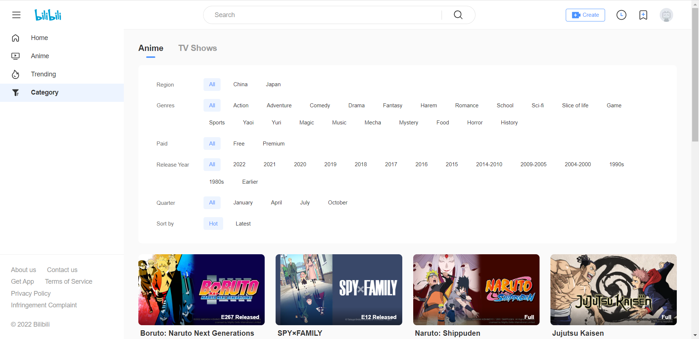

# 按标签筛选剧集

> https://api.bilibili.tv/intl/gateway/web/v2/ogv/index/items_v2

请求方式：`GET`

是否需要登录：`否`

## URL参数：

| 参数名           | 类型  | 必填  | 内容   | 备注                                                                                                      |
|---------------|-----|-----|------|---------------------------------------------------------------------------------------------------------|
| s_locale      | str |     | 语种代码 | 默认为英语                                                                                                   |
| platform      | str |     | 平台   | 查询总数会不同(?)                                                                                              |
| pn            | num |     | 查询页数 |                                                                                                         |
| ps            | num |     | 分页大小 | 默认10, 范围[1,50]                                                                                          |
| season_type   | str |     | 查询分类 | 1,4: Anime(动画) 2,3: TV Show(电视剧)                                                                    |
| area_id       | num |     | 产地   | -1: All(全部) 1: China(中国) 2: Japan(日本)                                                           |
| style_id      | num |     | 类型标签 |                                                                                                         |
| season_status | num |     | 状态   | -1: All(全部) 0: Free(全集免费) 1: Premium(部分集数为会员专享)                                                 |
| index_year    | num |     | 开播年份 | -1: All(全部),可用范围标识, 例:   [2022,2023)表示查询2022年一年的数据, 不包含2023年 [2010,2014]表示查询2010到2014年, 包含2014年 |
| index_month   | num |     | 开播月份 | 可选[1,4,7,10]                                                                                            |
| order         | num |     | 排序方式 | 0: Hot(热度优先) 2: latest(最近更新)                                                                        |

## 语种代码：

| 语言代码  | 说明     |
|-------|--------|
| en_US | 英语     |
| th_TH | 泰语     |
| vi_VN | 越南语    |
| id_ID | 印度尼西亚语 |
| ms_MY | 马来语    |

## 类型标签

| code  | name          | 翻译  |
|-------|---------------|-----|
| -1    | All           | 全部  |
| 5     | Harem         | 后宫  |
| 16    | Slice of life | ？   |
| 23    | Sports        | 运动  |
| 57    | Fantasy       | 奇幻  |
| 67    | History       | 历史  |
| 71    | Sci-fi        | 科幻  |
| 72    | Music         | 音乐  |
| 93    | School        | 校园  |
| 106   | Food          | 美食  |
| 122   | Magic         | 魔法  |
| 124   | Mystery       | 悬疑  |
| 1210  | Adventure     | 冒险  |
| 10001 | yaoi          | 腐   |
| 10002 | Yuri          | 百合  |
| 11001 | Action        | 动作  |
| 11003 | Comedy        | 搞笑  |
| 11004 | Drama         | ？   |
| 11007 | Romance       | 恋爱  |
| 11011 | Game          | 游戏  |
| 11017 | Mecha         | 机甲  |
| 11020 | Horror        | 恐怖  |

## Json回复

### 根对象: 

| 字段名     | 类型  | 内容   | 备注                   |
|---------|-----|------|----------------------|
| code    | num | 响应码  | 0: 成功 -400: 参数错误 |
| message | str | 0    |                      |
| ttl     | num | 1    |                      |
| data    | obj | 信息本体 |                      |

### `data`对象: 

| 字段名      | 类型    | 内容      | 备注                |
|----------|-------|---------|-------------------|
| cards    | array | 返回的剧集信息 | 如果没查到结果, 该字段为null |
| total    | num   | 记录总数    |                   |
| size     | num   | 分页大小    |                   |
| num      | num   | 当前页数    |                   |
| has_next | bool  | 是否有下一页  |                   |

### `data`对象`cards`数组中的对象: 

| 字段名           | 类型    | 内容          | 备注  |
|---------------|-------|-------------|-----|
| type          | str   | `ogv`       |     |
| card_type     | str   | `ogv_anime` |     |
| title         | str   | 剧集名称        |     |
| cover         | str   | 封面          |     |
| view          | str   | 观看总量        |     |
| styles        | str   | `空串`        |     |
| style_list    | array | 类型标签列表      |     |
| season_id     | str   | 剧集id        |     |
| episode_id    | str   | `空串`        |     |
| index_show    | str   | 更新提示        |     |
| label         | num   | `0`         |     |
| rank_info     |       | `null`      |     |
| view_history  |       | `null`      |     |
| watched       | str   | `空串`        |     |
| duration      | str   | `空串`        |     |
| view_at       | str   | `空串`        |     |
| pub_time_text | str   | `空串`        |     |
| unavailable   | bool  | `false`     |     |
